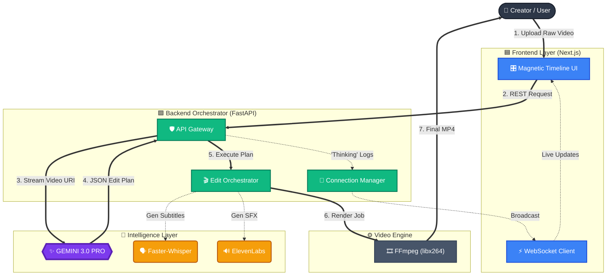

# VOXEDIT-AI 🎬

**Autonomous Multimodal AI Video Editing Agent Powered by Gemini 3**

---

VoxEdit is an agentic Non-Linear Editor (NLE) that transforms natural language into frame-accurate video edits.

Unlike traditional AI tools that rely only on transcripts, VoxEdit uses Gemini 3's native multimodal reasoning to simultaneously see, hear, and reason over video.

**It doesn't suggest edits. It plans, validates, and executes them autonomously.**

---

## 🎥 Project Demo


[](https://youtu.be/aAumkcwuHwc)

Watch the **"Blue Mug Test"** to see compound multimodal reasoning in action.

---

## 🌐 Deployment

VoxEdit uses a compute-intensive backend for multimodal video processing, 
frame-accurate rendering, and structured edit-plan validation.

Due to the GPU and CPU requirements of real-time video reasoning and re-encoding,
a public live deployment was not provisioned for the hackathon timeframe.

Instead:

- A complete end-to-end demo video is provided
- The full source code is publicly available
- Detailed setup instructions are included for local execution

The demo showcases real uploads, real Gemini 3 multimodal reasoning,
and real frame-accurate video rendering — not mocked outputs.

For reviewers wishing to test locally, please follow the setup guide below.

---

## 📌 The Problem

Video editing remains fundamentally manual.

While generative AI can create content instantly, editing is still:

- **Timeline-driven**
- **Frame-by-frame**
- **Mechanically repetitive**

Creators spend nearly **40% of their time** scrubbing footage, cutting silence, and searching for specific moments.

### Current AI editors fail because they are text-bound

They edit from transcripts, not video.

They cannot execute instructions like:

- *"Cut when I wave goodbye."*
- *"Keep the product shot even if I'm silent."*
- *"Remove awkward pauses, but preserve intentional silence."*

**Why?** Because they cannot reason over visual context + audio semantics simultaneously.

---

## 🚀 The Solution — Multimodal Agency

**VoxEdit is not an assistant. It is an AI editing agent.**

By leveraging Gemini 3 Pro's multimodal architecture, VoxEdit treats video editing as a **reasoning problem** rather than a signal-processing task.

### Why Gemini 3?

We directly feed raw video streams and audio signals into Gemini 3 Pro.

Gemini 3 performs:

- Cross-modal correlation (video + audio alignment)
- Temporal reasoning across frames
- Intent decomposition from natural language
- Structured decision planning

It outputs a strict, machine-executable **JSON Edit Plan**, containing:

- Frame-accurate timestamps
- Logical conditions
- Action directives

**Without Gemini 3's native multimodal reasoning, this level of semantic editing would not be possible.**

---

## 🧩 Core Capabilities

### 🧠 Multimodal "Reasoning Cuts"

Execute compound logic across modalities:

> *"Remove all silence (Audio), BUT keep segments where the blue mug is visible (Video)."*

Gemini 3 correctly identifies:

- Silence segments
- Visual object persistence
- Override logic conditions

**Status:** Solved with structured reasoning validation.

---

### 👁 Transparent AI Reasoning Console

**AI should not be a black box.**

VoxEdit streams Gemini's reasoning in real time via WebSockets:

```
DETECTED: Awkward Pause (Confidence: 98%)
DETECTED: Blue Mug Visible (Frame 432–611)
DECISION: Override Silence Cut
```

Users see **why** edits are happening.

---

### ⚡ Frame-Accurate Rendering Engine

We built a custom FFmpeg wrapper.

Instead of using stream copy (which snaps to keyframes), we:

- Force libx264 re-encoding
- Implement filter graph pipelines
- Guarantee millisecond-level precision

This preserves **semantic correctness** over raw speed.

---

### 🎨 Generative Asset Pipeline

- **Subtitles:** Faster-Whisper (local, low latency)
- **Voice & SFX:** ElevenLabs
- Synchronized directly with Gemini's structured edit plan

---

## 🏗 System Architecture



---

## 🛠 Technology Stack

| Layer | Technology | Why |
|-------|-----------|-----|
| **Reasoning Engine** | Gemini 3 Pro | Native multimodal reasoning + structured output |
| **Backend** | FastAPI (Python) | Async orchestration of heavy video tasks |
| **Video Engine** | FFmpeg (libx264) | Frame-accurate control |
| **Frontend** | Next.js 14 + React | Complex state + timeline UI |
| **Real-Time** | WebSockets | Transparent reasoning stream |
| **Speech** | Faster-Whisper | Local high-speed transcription |
| **Audio Gen** | ElevenLabs | Dynamic contextual SFX |

---

## 📂 Project Structure

```bash
VOXEDIT-AI/
├── 📂 backend/                     #  Python FastAPI Backend
│   ├── 📂 __pycache__/             #  Compiled Python bytecode (auto-generated)
│   ├── 📂 ffmpeg/                  #  Local FFmpeg binaries (if static linked)
│   ├── 📂 services/                #  Business Logic & AI Modules
│   │   ├── 📂 __pycache__/         #  Service-level bytecode
│   │   ├── 📜 ai_agent.py          #  Core Gemini 3.0 Pro reasoning engine
│   │   ├── 📜 sfx_gen.py           #  Sound Effect generation logic
│   │   ├── 📜 subtitle_gen.py      #  Faster-Whisper transcription service
│   │   ├── 📜 video_engine.py      #  Custom FFmpeg rendering pipeline (libx264)
│   │   └── 📜 voice_gen.py         #  ElevenLabs TTS generation wrapper
│   ├── 📂 temp_storage/            #  Temp folder for uploads & processed videos
│   ├── 📜 .env                     #  Backend API keys (Gemini, ElevenLabs)
│   ├── 📜 list_models.py           #  Utility script to check available Gemini models
│   ├── 📜 main.py                  #  Server Entry Point (FastAPI + WebSockets)
│   └── 📜 requirements.txt         #  Python dependency list
│
└── 📂 frontend/                    #  Next.js 14 Frontend
    ├── 📂 .next/                   #  Next.js build output (auto-generated)
    ├── 📂 node_modules/            #  Node.js dependencies (React, Tailwind, etc.)
    ├── 📂 public/                  #  Static assets (images, icons)
    ├── 📂 app/                     #  App Router (Main Application Code)
    │   ├── 📜 favicon.ico          #  Browser tab icon
    │   ├── 📜 globals.css          #  Global styles & Tailwind directives
    │   ├── 📜 layout.tsx           #  Root layout (fonts, metadata)
    │   └── 📜 page.tsx             #  Main Editor Dashboard Page
    ├── 📂 components/              #  UI Components
    │   ├── 📂 editor/              #  Video Editor Specific Components
    │   │   ├── 📜 AIGenPanel.tsx         #  UI for generating Assets (SFX/Subs)
    │   │   ├── 📜 Player.tsx             #  HTML5 Video Player Controller
    │   │   ├── 📜 ReasoningPanel.tsx     #  Real-time "AI Brain" Console (WebSockets)
    │   │   ├── 📜 Sidebar.tsx            #  Left navigation bar
    │   │   ├── 📜 Timeline.tsx           #  Magnetic Timeline visualization
    │   │   ├── 📜 ToolsPanel.tsx         #  Tool selector (Cut, Select, AI)
    │   │   └── 📜 TopBar.tsx             #  Header & Export controls
    │   └── 📜 components.json      #  Shadcn UI component configuration
    ├── 📂 lib/                     #  Utility functions (class merging, helpers)
    ├── 📜 .gitignore               #  Git ignore rules
    ├── 📜 components.json          #  UI library config
    ├── 📜 eslint.config.mjs        #  Code linting configuration
    ├── 📜 next-env.d.ts            #  TypeScript definitions for Next.js
    ├── 📜 next.config.mjs          #  Next.js build configuration
    ├── 📜 package-lock.json        #  Exact dependency versions
    ├── 📜 package.json             #  Project scripts & dependencies
    ├── 📜 postcss.config.mjs       #  CSS processing config
    ├── 📜 tailwind.config.ts       #  Tailwind CSS theme configuration
    └── 📜 tsconfig.json            #  TypeScript compiler options
```
---

## 🧠 Technical Challenges & Engineering Solutions

### 1. Hallucination vs Determinism

**Problem:** LLMs can generate plausible but incorrect timestamps.

**Solution:**

- Strict JSON schema enforcement
- Timestamp validation middleware
- Retry loop with constraint injection
- Video-duration boundary checks

Gemini outputs are validated before execution.

---

### 2. Keyframe Snapping Problem

**Problem:** Standard FFmpeg copy mode snaps cuts to nearest keyframe.

**Solution:**

- Custom filter graph pipeline
- Forced re-encoding via libx264
- Frame-level precision over performance shortcuts

---

### 3. Making AI Trustworthy

**Problem:** Users distrust invisible decision systems.

**Solution:**

- Real-time reasoning broadcast
- Transparent decision logs
- Deterministic execution trace

---

## 🚀 Roadmap

- [ ] Local-first rough cuts using lightweight Gemini variants
- [ ] Multi-track agent reasoning (A-roll + B-roll)
- [ ] Export to Premiere Pro / DaVinci Resolve via XML / EDL
- [ ] Automated B-roll coverage agent

---

## 💻 Getting Started

### Prerequisites

Before you begin, ensure you have the following installed:

* **Python 3.10+:** [Download Here](https://www.python.org/downloads/)
* **Node.js 18+:** [Download Here](https://nodejs.org/)
* **FFmpeg:** [Download Here](https://www.ffmpeg.org/download.html)
* **FFmpeg:** **Critical Requirement.** You must install FFmpeg and add it to your System PATH.
   * Windows Guide: [How to install FFmpeg on Windows](https://www.wikihow.com/Install-FFmpeg-on-Windows)
   * Verify installation: Open a terminal and type `ffmpeg -version`. If it prints version info, you are ready.

---

## 1️⃣ Backend Setup (Python & FastAPI)

The backend handles the AI reasoning, video rendering, and WebSocket streams.

### 1. Navigate to the backend folder:

```bash
cd backend
```

### 2. Create a virtual environment:

```bash
python -m venv venv
```

### 3. Activate the virtual environment:

**Windows:**
```bash
venv\Scripts\activate
```

**Mac / Linux:**
```bash
source venv/bin/activate
```

### 4. Install dependencies:

```bash
pip install -r requirements.txt
```

### 5. Configure Environment Variables:

Create a file named `.env` inside the `backend` folder and add your API keys:

```env
GEMINI_API_KEY=your_google_gemini_key_here
ELEVENLABS_API_KEY=your_elevenlabs_key_here
```

(Get your Gemini Key from [Google AI Studio](https://aistudio.google.com/))

### 6. Start the Server:

```bash
python main.py
```

You should see: `INFO: Uvicorn running on http://0.0.0.0:8000`

---

## 2️⃣ Frontend Setup (Next.js)

The frontend is the visual NLE interface.

### 1. Open a new terminal and navigate to the frontend folder:

```bash
cd frontend
```

### 2. Install Node dependencies:

```bash
npm install
```

### 3. Start the Development Server:

```bash
npm run dev
```

---

## 🚀 Launch the App

Open your browser and navigate to: **http://localhost:3000**

* **Test the Connection:** Look at the "Reasoning Panel" on the right side. It should say **"CONNECTED"** in green, indicating the WebSocket link to the Python backend is active.

---
---

## 👤 Author

**Naveen Kumar**  
*Student@CIT aspiring Full Stack & AI Engineer*


---
